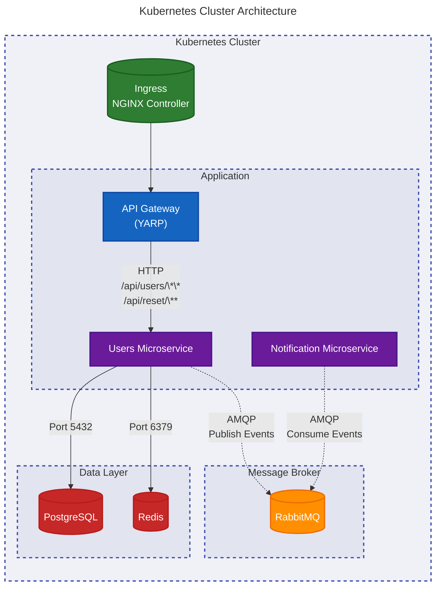

# My Application Projects:
- [API Gateway](https://github.com/HikashiMlbb/MicroserviceExperiment.Gateway)
- [Users Microservice](https://github.com/HikashiMlbb/MicroserviceExperiment.Users)
- [Notification Microservice](https://github.com/HikashiMlbb/MicroserviceExperiment.Notification)
